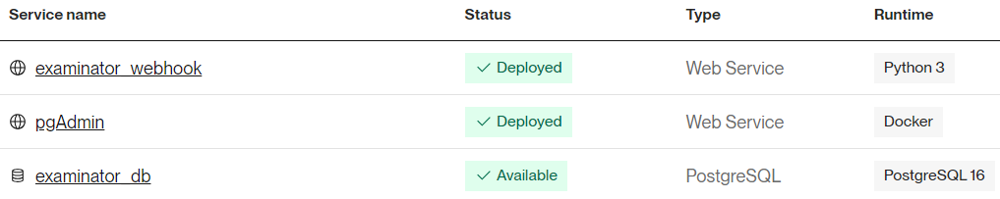

##  Саймон! 🎓

> ⚠️ **_Саймон_** прекратит свою работу после сдачи экзамена последней группой - `04.07.2024`.

**Привет! Я бот для подготовки к экзамену по бухгалтерскому учету. Приятно познакомиться!** 🤝


## Содержание
- [Примеры работы](#примеры-работы)
- [Реализация](#реализация)
  - [Структура проекта](#структура-проекта)
  - [Использованные инструменты](#использованные-инструменты)
  - [Деплой](#деплой)
- [Развертывание](#развертывание)
- [Немного радости](#немного-радости)

## Примеры работы

_Здесь будет **нечто**!_

## Реализация

### Структура проекта

🗄 Ниже приведена структура файлов и директорий проекта: 

```shell
\---bookkeeper_exam
    |   .gitignore
    |   LICENSE
    |   README.md
    |
    +---readme_images
    |       simon_1.jpg
    |       simon_2.jpg
    |       simon_3.jpg
    |
    \---server
        |   .env  # Файл с переменными окружения
        |   requirements.txt
        |
        +---migrations  # SQL-скрипты для создания и заполнения БД
        |       createdb.sql
        |       questions.sql
        |       sections.sql
        |       sessions.sql
        |       themes.sql
        |
        +---src  # Директория с исходным кодом
        |   |   cli.py
        |   |   config.py
        |   |   main.py
        |   |   setup.py
        |   |
        |   +---database
        |   |       connection.py
        |   |       models.py
        |   |
        |   +---enums
        |   |       colors.py
        |   |       literals.py
        |   |       logs.py
        |   |       markups.py
        |   |       strings.py
        |   |       types.py
        |   |
        |   +---handlers
        |   |       buttons_handler.py
        |   |       commands_handler.py
        |   |       exam_handler.py
        |   |       poll_handler.py
        |   |       quiz_handler.py
        |   |       utility_handlers.py
        |   |
        |   +---loggers
        |   |       setup.py
        |   |
        |   +---middlewares
        |   |       auth_middleware.py
        |   |       log_middleware.py
        |   |       miscellaneous.py
        |   |       update_middleware.py
        |   |
        |   \---services
        |           entities_service.py
        |           utility_service.py
        |
        \---static  # Исходные "сырые" файлы с вопросами 
                parsed.json
                raw.pdf
```

### Использованные инструменты

1. Язык программирования - `Python 3.12.4`;
2. Фреймворк для работы с `TelegramBotAPI` - `aiogram 3.7.0`;
3. ORM-библиотека - `SQLAlchemy 2.0.30`;
4. СУБД - `PostgreSQL 16`;
5. Прочие зависимости описаны в файле `server/requirements.txt`.

> 📄 **_Весь код задокументирован_**. Вы можете ознакомиться с каждой интересующей вас строкой!

### Деплой

🌐 Для деплоя проекта использовался _serverless_ сервис [Render.com](https://render.com/).

Были развернуты два web-сервиса:
  - Webhook-сервис, на котором **Саймон** "слушает" входящие запросы от Telegram ✈️;
  - Сервис pgAdmin для удобного доступа к БД.

А также инстанс БД `PostgreSQL 16`.

Так выглядит **Dashboard** деплоя:



И ~~великолепные~~ логи:


## Развертывание

> 🛠 **Саймон** может быть запущен в двух режимах - `webhook`/`polling`. Выбрать режим запуска можно с помощью следующих аргументов командной строки:
> 1. `--webhook`
> 2. `--polling`
> 
> В инструкции ниже описан процесс развертывания **_только_** в режиме `--polling` 😢

Для локального развертывания необходимо прочесть некоторые 🪄 **_заклинания_** 🪄 в следующем порядке:
1. При помощи [BotFather](https://t.me/BotFather) создать нового бота. Можете заполнить информацию о нем и добавить аватар, если желаете.
2. **[НЕОБЯЗАТЕЛЬНО]** _Для удобства_ зарегистрируйте команды, которые будут доступны из `Меню`:
   - `/start`;
   - `/restart`;
   - `/exam`;
   - `/heal`;
   - `/change_hints_policy`.
3. Получите токен доступа. Он должен выглядеть примерно так: `1234567890:aBCDeFghIjKLmnoPQRSTUvwXYzAbcDefGHi`.
4. Клонируйте этот репозиторий с помощью `git clone`.
5. Находясь в папке `server` создайте виртуальное окружение и установите зависимости:
    ```shell
    python -m venv venv
    .\venv\Scripts\activate
    pip install -r .\requirements.txt
    ```
6. Создайте и заполните БД:
    ```shell
    psql -U postgres -f .\migrations\createdb.sql -f .\migrations\questions.sql -f .\migrations\sections.sql -f .\migrations\sessions.sql -f .\migrations\themes.sql
    ```
    > ⚠️ Обратите внимание на то, что в `58` строке файла `createdb.sql` необходимо указать ваш `TelegramID`:
    > ```postgresql
    > INSERT INTO users (telegram_id) VALUES ('<ВАШ_TG_ID>');
    > ```
    > Получить свой идентификатор можно у **_[этого бота](https://t.me/useridinfobot)_**.
7. Создайте файл окружения `.env` и заполните его по примеру файла `example.env`.
8. Запустите бота командой:
    ```shell
    python .\src\main.py --polling
    ```
9. Победа! ✅

## Немного радости

📸 Вот вам напоследок несколько моих фотокарточек для поднятия настроения:

<table align="center">
  <tr>
    <td>
        
    </td>
    <td>
        
    </td>
    <td>
        
    </td>
  </tr>
</table>

#

**_Made by [@shasoka](https://t.me/shasoka)_**